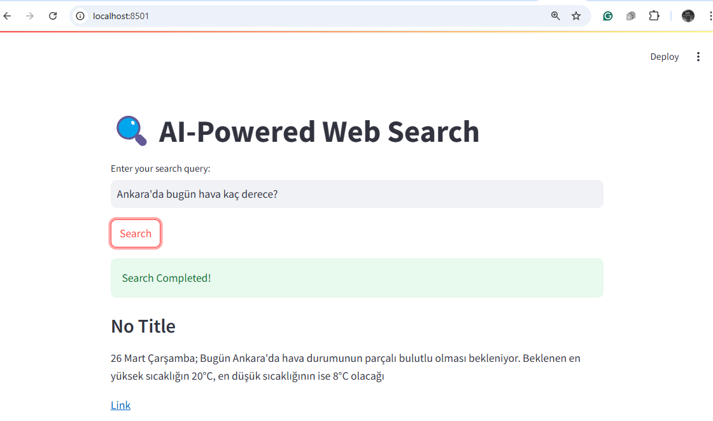

- x05a_streamlit_search_tavily.py
```python
import streamlit as st
from langchain.tools import tool
from langchain_community.tools import TavilySearchResults  # Replace SerpAPI with Tavily
from dotenv import load_dotenv

# Load environment variables (e.g., Tavily API key)
load_dotenv()

# Set up Tavily Search
tavily_search = TavilySearchResults()

@tool
def search_web(query: str) -> str:
    """Search the web for real-time information using Tavily."""
    results = tavily_search.run(query)
    return str(results)  # Convert results to string for display

# Streamlit UI
st.title("🔍 AI-Powered Web Search")

# User input
query = st.text_input("Enter your search query:")

if st.button("Search"):
    if query:
        with st.spinner("Fetching results..."):
            results = search_web.run(query)
        st.success("Search Completed!")
        st.write(results)
    else:
        st.warning("Please enter a query.")
```

#### Run
```commandline
streamlit run x05a_streamlit_search_tavily.py 
```
- Output



---